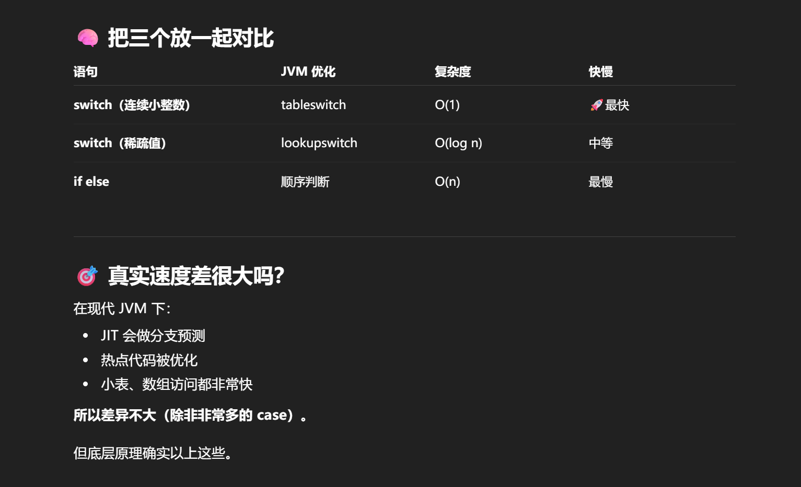

#### 写在前面
本片文章将作为Java复习的第一篇文章，主要内容还是围绕java Collection Framework进行， 以及后面会有线程， 高级语法等。

重点还是在探究一下java更多的底层， 加深对语言的了解。

此外，本文将参考java核心技术卷

>其实，我还是挺感慨的，时隔大半年，HZY再次打开了IDEA， 希望这是一次比较愉快的旅行

## JAVA核心技术卷1
### 第一章 Java程序设计概述
#### Java的优点
* Java除了解释器以外，还有即时编译的功能，在一些执行比较频繁的代码上，将字节码序列转为机器码，提升速度
* Java字符串使用Unicode码
* Java的解释性
* Java处理并发十分优秀

### 第三章 Java基本程序设计
* Java区分大小写： 
* 8种基本类型
	* 4种整型（java没有unsigned）
		* int: 4字节 -2147483648~2147483647 （正负20亿）
		* short: 2字节 -32768~32767
		* long: 8字节 -9223372036854775808~9223372036854775807
		* byte： 1字节 -128~127
	* 2种浮点 (我们不写过多原理在这里)
		* float: 大约6~7位有效数字
		* double： 大约15位有效数字

		>浮点永远不能支持金融计算，二进制中无法精确表示1/10，就像10进制无法精确表示1/3
		所以，如果想要精确表示，使用BigDecimal类
	* 1种字符
		* char

		>这里有一些比较阴间的点，java中char可以用16进制表示\u0000~\uFFFF
		例如 // \u000A is a newline 会报错，因为 Unicode转移序列会在解析代码之前，不过IDEA能提示出来

		>java 使用 UTF-16 作为内部字符编码。一个 char 是一个 UTF-16 编码单元，占 16 bit（2 字节）。但是对于 BMP 以外的 Unicode 字符（如 emoji、乐谱符号），需要使用两个 char（也就是一个“代理对”）才能表示，因此单个 char 无法容纳所有 Unicode 字符。
		我认为这一点十分重要，需要重点熟悉
	* boolean 类型
		**java中布尔不允许数字转布尔**
		比如，if (x=0) 是不被允许的，java中只能有true和false
	``` java
	//整型
	long => 100L | 100l
	0x100 | 0X100 //十六进制
	010 //八进制
	//浮点
	1.12f   1.12F
	12.2d   12.2D
	//注意
	Double.isNAN(x)  //合法
	Double.NAN == x  //不合法，永远nerve
	```


##### 变量与常量
>这部分hzy并没有完全按照书上的逻辑推进，而是只写了相对重要或者不熟悉的，对于完全熟悉的，则自动跳过
* java10 支持了 var 自动推断变量类型
* final 定义常量
* 类常量
	>public static final double CM_PER_INCH = 2.54
* const 是java保留的关键字，但没有使用
* 枚举类型： enum
* Math类
	* sqrt(w)
	* pow(x,a)
	* Math.PI
	* Math.E
可以使用import static java.lang.Math.*

Math类中都是基于浮点数的，如果想要一个精确的结果，使用StrictMath类
* 经典余数问题
>新手往往绕不开，一个余数到底是正数还是负数，往往会需要做一些优化操作，保证余数不是负数，这里先不探究，我记得之前研究过，把笔记移植过来
* 类型转换
	* 隐式转换 这里需要插一张图，掠过了先
	* 强制转换
	>int a = (int) Math.round(x)
* java的移位运算符
> jav中有>>和>>>所以能很好，准确处理高位是按照原来的填充，还是补0，C++则不好确定>>的高位的处理
* java中字符串类型String是不可变类型
> 也就是说，我们无法通过‘字符数组’这种方式改变字符串
比如，把“Hello”改为“Hellp”，java没有update方法，我们只能用substrin()提取子串再拼接
java中异于其他语言的重要的一点还有String的比较
== 还是 .equals()    请记住，== 只用来判断对象是否处于一个‘内存地址’，而不能比较内容
##### String
书上在这里详细地说了String类，那我们也详细写一些
``` java
char charAt(int index)        //不怎么推荐使用吧，除非你保证你知道底层原理，不会出现···
boolean isEmpty()
boolean isBlank()
boolean equals(Object other)
boolean equalsignoreCase(String other)
boolean startWith(String prefix)
boolean endWith(String suffix)
int indexOf()  //这个方法有很多变种
String replace(CharSequence oldstr,CharSequence newstr)
String substring(int begin)
String substring(int begin,int end)
String toLowerCase()
String toUpperCase()
String strip()   //这个函数要记住，不要使用trim()
String join(CharSequence dolimiter, CharSequence elements) 
String repeat(int count)  //java11 才加  

String greeting = """
He\
llo
World""";
//这个转义符可以和下一行连接

```
上面的CharSequence是一个属于字符串的接口，String,StringBuilder,StringBuffer,CharBuffer都属于这个接口

直接使用Ctrl + H / Ctrl + Alt + U 查看类继承
##### StringBuilder | StringBuffer
这俩的api都是一样的，不过，StringBuilder效率更高，但StringBuffer支持多线程
``` java
StringBuilder builder = new StringBuilder()
builder.append(ch)
builder.append(str)
String resultstr = builder.toString()

builder.appendCodePoint(int cp) //追加一个码点, 我是新我不用
builder.insert(int offset,char c)
builder.delete(int startindex,int endindex)

```
##### java OI
``` java
//初学者OI套
import java.util.*

Scanner in = new Scanner(System.in);
String str = in.nextLine();   //提取一行，以换行符结束
String word = in.next();   //遇见空格就停止
int age = in.nextInteger();

System.out.print()

// Console类
Console cons = System.Console()
String username = cons.readLine("User name:")
//不过这个玩意，你在IDEA里面一定是null，只有在控制台里面才能正常执行

//Scanner 的api
Scanner(InputStream in)
String nextLine()
String next()
int nextInt()
double nextDouble()

new Scanner(Path.of(""),StandardCharsets.UTF-8)
//sout
System.out.print();
System.out.printf();
System.out.println();

System.out.printf() //沿用c风格

```
>我们这里补充许多java coder 都会遇到的一个问题，在IDEA里，总是找不到jvm启动的时候的执行目录在哪里
我们这里来说一下，调用 System.getProperty("user.dir") 就可以知道了 

``` java
System.out.println(System.getProperty("user.dir"));
Scanner file = new Scanner(Path.of("statics/a.txt"), StandardCharsets.UTF_8);
System.out.println(file.nextLine());
```
对于OI先说到这里不能废太多篇幅
##### 控制流程
条件循环分支
``` java
if - else if - else;
while();
do{}while();
for();
switch (){};
//这里我们说说switch
switch (choice) {
	case 1 -> ···
	case 0 -> ···
	case 2 -> ···
	case 3 -> ···
	default -> 
}
switch (choice) {
	case 1 : ··· break;
}

//下面我们来看看优美的switch
//无直通行为
int num = switch (choice) {
	case 1,2 -> {
		System.out.print("我赢");
		yield 6;
	} 
	case 3 -> yield 7;
	default -> yield 8;
}
switch (choice) {
	case 1,2 -> {
		System.out.print("我赢");
		num = 6;
	} 
	case 3 -> num = 7;
	default -> num = 8;
}

//把上面箭头换成冒号，就有直通了，你需要加break,不加就死，但是yield自动返回
int num = switch (choice) {
	case 1,2 : {
		System.out.print("我赢");
		yield 6;
	} 
	case 3 : yield 7;
	default : yield 8;
}
switch (choice) {
	case 1,2 : {
		System.out.print("我赢");
		num = 6;
		break;
	} 
	case 3 : num = 7;break;
	default : num = 8;
}
//注意，在switch中不能使用return break continue ，有需求就用yield
//当你复习到这里，能够理解这里的四种switch，其实就很强了
//对于加注解， 这个不做要求
```
##### 大数
``` java
import java.math.BigInteger,BigDecimal;

BigInteger a = BigInteger.valueOf(100);
BigInteger reallybig = BigInteger.valueOf("222222222222222222222222222222222222222222222222222222");
a.add(a);
a.multiply(a);
a.sqrt();
a.mod(a);
a.divide(a);
a.compareTo(a); //比较返回结果是int 的 0 或者正负数

```
>在旧 Java（JVM 编译为 tabelswitch/lookupswitch）中：
switch 对小整数范围最快（O(1) 查表）
switch 对稀疏值用二分查找（O(log n)）
if else 是顺序判断（O(n)）
这个知识点绝对是阴间了
但是，现代JVM已经优化的很好了，没什么区别。
这些阴间的知识点还是不要上桌了


##### 数组
``` java
//java对你的数组很宽限
int[] a = {
	1001,
	1111,
}//你多了一个逗号，java是允许的
//匿名函数优化
smallPrimes = new int[] {17,16,15};
//等价于
int[] temp = {17,16,15};
Primes = temp;
//java允许长度为0的数组
new ele[0]
new ele[] {}
//以上都是length为0 的数组，但不是null
```
``` java
//for each 拯救遍历
for(n : num) {}
//Java中一般的赋值都是浅拷贝
//如果要深拷贝
newarr = Arrays.copy(oldarr,2*oldarr.length)

//排序
import java.util.Arrays

Arrays.sort(num);  //底层是优化了的快速排序
Arrays.binarySearch(T[] t,T t1);
Arrays.binart
```
##### 命令行参数
String[] args ，命令行参数存储在args
