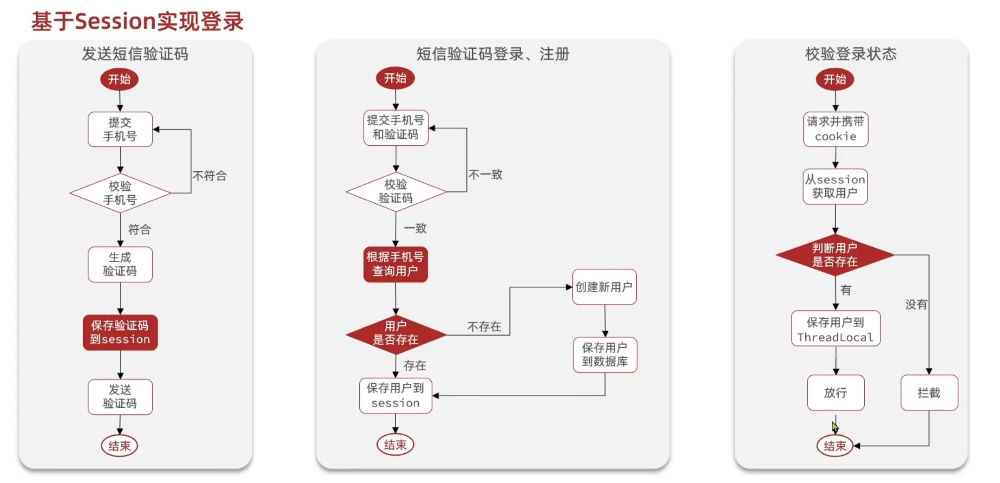

#### 初始Redis

##### 什么是NoSql
原子性，一致性，隔离性，持久性

* 结构化与非结构化
* 关联与非关联
* sql查询与非sql
* 是否支持事:ACID与BASE
* 存储方式
* 扩展性:垂直与水平(是否支持分布式)

##### 认识Redis
* k-v数据库：支持多种类型
* 单线程，具有原子性
* 低延迟，速度快(基于内存，IO多路复用，良好的编码)
* 支持数据持久化
* 支持主从集群，分布集群
##### 安装Redis
* 安装路径`/usr/local/bin`
* 启动 `redis-server`
* redis默认是前台启动，我们要修改为后台启动
    * /usr/local/src/redis-版本号/redis.conf
    * 修改配置文件

        ``` bash
        bind 127.0.0.1  -> 0.0.0.0
        daemonize no -> yes     #守护进程
        requirepass  123456 #设置密码
        port 6379
        dir .
        databases 1 #默认是16个库
        maxmemory 512mb
        logfile "redis.log"
        ```
    * redis-server redis.conf #这里要写好路径位置
    * ps -ef | grep redis

* 开机启动脚本
    * 写脚本

    ``` 
    [Unit]
    Description=redis-server
    After=network.target
    ​
    [Service]
    Type=forking
    ExecStart=/usr/local/bin/redis-server /usr/local/src/redis-6.2.6/redis.conf
    PrivateTmp=true
    ​
    [Install]
    WantedBy=multi-user.target
    ```
    * 重启服务：sustemctl daemon-reload
    * systemctl start redis 
    * systemctl enable redis

##### Redis命令行客户端
``` bash
redis-cli [options] [commonds]
redis-cli -h 127.0.0.1 -p 6379 -a 密码

redis-cli
AUTH 密码
```
#### Redis常见命令

##### Redis数据结构
key一般是String
value多样
* 基础类型
    * String 
    * Hash
    * List
    * Set
    * SortedSet
* 特殊类型 
    * GEO
    * BitMap
    * HyperLog

##### 命令
* help 
* keys 
    * keys [pattern]不建议使用，因为是模糊查询，速度慢，容易堵塞
* DEL
    * DEL k1 k2 k4 
* EXISTS 
    * exist key
* EXPIRE   
    * expire key time
    * expire age 20 
* TTL
    * TTL key
    * 值为-1：永久有效
    * 值为-2：死掉了

##### 字符串String
String虽然叫做字符串，但是对于存储数字，如果我用字符数组去存，占用空间肯定很大，所以底层是编码为数字再到二进制数据存储数字，所以String底层不一定是String，你甚至可以把图片存为"String"

最大空间不能超过512M
* msg
* num 
* score

命令:
* set key value ：设置或更改
* get key
* mset k1 v1 k2 v2 ：批量set
* mget k1 k2 :
* incr key : 让value自增1
* incrby key increament : 自定义自增
    * incrby ket -1 :实现自减 (虽然说有自减这个操作，但是我们没有定义)
* incrbyfloat: 浮点数自增，必须定义步长
* setnx key val : 只增加，如果有就不管了
    * set key val nx :一样的用法
* setex key seconds value
    * set key value ex seconds

* key层级结构
    项目：业务：类型：id
##### Hash类型
* HSET: 
    * hset key field value
* HGET 
    * hget key field
* HMSET:
    * hmset key f1 v1 f2 v2
* HMGET 
    * hmget key f1 f2 
* HGETALL (输出f1,v1,f2,v2)
    * hgetall key
* HKEYS 
* HVALS
* HINCRBY:
* HSETNX: 判断field是否存在
    * hsetnx key field value

##### List类型
底层可以看做双向链表
* 有序
* 元素可重复
* 插入删除块
* 查询速度一般

* LPUSH key element [element]
* LPOP key
* RPUSH key element
* LPOP key
* LRANGE key start end
    * lrange key 1 2 
* BLPOP 和 BRPOP ：与LOPOP和RPOP相似，但是可以在没有元素的时候等待指定时间，而不是直接返回nil
    * BLPOP key 100  等100s

##### Set
* 无序
* 不可重复
* 查找快
* 支持集合操作

* SADD key member
* SREM key member
* SCARD key: 返回总数
* SISMEMBER key member
* SMEMBERS: 获取所有元素

* SINTER k1 k2 ：交集
* SDIFF k1 k2 : 差集 k1差k2
* SUNION k1 k2 : 并集

##### SortedSet
* 可排序
* 元素不重复
* 查询速度快
* 底层是跳表和hash表
* 经常用来实现排行榜

* ZADD key score member
* ZREM key member
* ZSCORE key member
* ZRANK key member
* ZCARD key 
* ZCOUNT key min max :根据score获得count,两端都是闭合[0,80]
* ZINCRBY key increment member 
* ZRANGE key min max : 根据排名获取元素
* ZRANGEBYSCORE key min max :
* ZDIFF,ZINTER,ZUNION

* 使用ZREVRANGE可使用降序排序，都可以用ZREV

#### 客户端
* jedis
    * 以命令作为方法名，简单实用
    * 线程不安全，多线程环境需要连接池
* lettuce 
    * netty实现的，线程安全
    * 支持哨兵，集群，管道
* Redisson 
    * 基于Redis实现的分布式，

* Spring Data Redis : 底层可有jedis和lettuce实现


//注意事项，记得放开redis的端口，要么就直接关闭防火墙
##### Jedis入门
``` java
@SpringBootTest
class RedisApplicationTests {
    private Jedis jedis;
    @BeforeEach
    void connect(){
        jedis = new Jedis("192.168.200.130",6379);
        jedis.auth("123456");
        jedis.select(1);
    }
    @AfterEach
    void disconnect(){
        if(jedis != null){
            jedis.close();
        }
    }

    @Test
    void contextLoads() {
        jedis.set("hello", "world");
        String hello = jedis.get("hello");
        System.out.println(hello);
    }
}
```

##### jedis线程池


##### Spring Data Redis
* 提供对不同客户端的整合
* 提供 RedisTemplate来进行
* 支持Redis的发布订阅模型
* 支持Redis哨兵和集群
* 支持Lettuce的响应式编程
* 支持序列化和反序列化
* 支持基于Redis的JDKCollection实现

依赖
* Redis
* 连接池 commons
* 配置redis
    * spring.data.redis.host=192.168.200.130
    * spring.data.redis.password=123456
    * 其他应该都默认配置好了

``` java
@SpringBootTest
public class Test2 {
    @Autowired
    private RedisTemplate redisTemplate;
    @Test
    public void test() {
        redisTemplate.opsForValue().set("name", "hzy");
        System.out.println(redisTemplate.opsForValue().get("name"));
    }
}

//但是打开redis，存的竟然是这个
//\xAC\xED\x00\x05t\x00\x03name
//\xAC\xED\x00\x05t\x00\x03hzy
//底层默认序列化了
//这样肯定有很多弊端，比如占用内存高，比如难看
//解决方法就是，我们自己配
@Configuration
public class RedisConfig {
 
    @Bean
    public RedisTemplate<String, Object> redisTemplate(RedisConnectionFactory connectionFactory){
        // 创建RedisTemplate对象
        RedisTemplate<String, Object> template = new RedisTemplate<>();
        // 设置连接工厂
        template.setConnectionFactory(connectionFactory);
        // 创建JSON序列化工具
        GenericJackson2JsonRedisSerializer jsonRedisSerializer = 
            							new GenericJackson2JsonRedisSerializer();
        // 设置Key的序列化
        template.setKeySerializer(RedisSerializer.string());
        template.setHashKeySerializer(RedisSerializer.string());
        // 设置Value的序列化
        template.setValueSerializer(jsonRedisSerializer);
        template.setHashValueSerializer(jsonRedisSerializer);
        // 返回
        return template;
    }
}

    public void test() {
        redisTemplate.opsForValue().set("name",new Person("hzy",88));
        System.out.println(redisTemplate.opsForValue().get("name"));
    }

/*
{
  "@class": "com.xjtuhelper.redis.bean.Person",
  "name": "hzy",
  "age": 88
}
*/
```
##### StringRedisTemplate
"@class": "com.xjtuhelper.redis.bean.Person" 
序列化和反序列化都得靠这个，但是对于redis而言，我们放在内存中，怎么能让这么一个东西占用空间呢，所以我们统一用String存，自己手动序列化

* 我们直接使用StringRedisTemplate

``` java
private ObjectMapper objectMapper=new ObjectMapper();
@Test
public void test() throws JsonProcessingException {
    Person hzy = new Person("hzy", 111);
    String json = objectMapper.writeValueAsString(hzy);
    stringRedisTemplate.opsForValue().set("hzy", json);
    String s = stringRedisTemplate.opsForValue().get("hzy");
    Person person = objectMapper.readValue(s, Person.class);
    System.out.println(person);
}
```

### Redis实战--黑马点评
* 短信登录
* 查询缓存
* 达人探店
* 优惠券秒杀
* 好友关注
* 附近商户
* 用户签到
* UV统计

#### 导入项目
遇到了一个很恶心的ERROR
>java: 警告: 源发行版 17 需要目标发行版 17
#### 短信登录
* 基于Session的短信验证码登录



Redis代替Session解决session共享问题

对于用户信息，用String还是Hash???
用String

#### 商户查询缓存

##### 什么是缓存
* 缓存的作用 
    * 降低后端负载
    * 提高读写效率
    * 降低响应时间
* 缓存的成本
    * 数据一致性成本
    * 代码维护成本
    * 运维成本
#### 开发经验
* 用String 还是 hash ？
    * 使用场景不同

    >我们这个缓存，缓存的是一个不会变的值，如果变了，其实是我们从数据库又读了一遍，所以针对这种情况我们直接使用string而不是hash

#### 缓存更新策略
* 内存淘汰
    * Redis自己的淘汰机制
* 超时剔除
    * 一致性一般
    * 维护成本低
* 主动更新
    * 一致性好
    * 维护成本高

面对业务进行选择
* 低一致性需求
* 高一致性需求

主动更新策略分类
* Cache Aside Pattern
    * coder自己写调用缓存的逻辑
* Read/Write Through Pattern
    *  我们不用管，服务会自己决定用redis还是sql
    * 我们只需要调服务就行
* Write Behind Caching Pattern
    * 调用者只操作缓存
    * 其他线程异步将缓存数据持久到数据库


最终选择Cache Aside Pattern 
* 删除缓存还是更新缓存
    * 更新缓存:

    >每次数据库更新，缓存就更新，无效写操作较多
    * 删除缓存:

    >每次数据更新，我直接把缓存删了，你下次有人访问的时候再读。所以包选这个啊
* 如何保证缓存与数据库的操作同时成功或失败
    * 单体系统：把缓存和数据库操作放在一个事务里面
    * 分布式系统：利用TCC等分布式事务方案
* 先操作缓存还是先操作数据库？多线程并发视角
    * 先删除缓存，再更新数据库： 拿到旧数据，并存入缓存，更新缓存失效
    * 先更新数据库，再删除缓存：也是拿到旧数据，但可能性耕地

#### 缓存穿透
当有恶意的小人查一堆空id(或者其他)，redis查不到，db也查不到，如果他搞10000次请求，那就炸了，10000请求到数据库上
* 缓存空对象(使用这个)
    * 实现简单，维护方便
    * 缺点：
        * 数据不一样
        * 额外的内存消耗
* 布隆过滤(经典加一层)
    * 存在误判的问题

>实际开发中，我也不知道怎么选，这个老师选的存空值，只能说所有事情都是各有利弊,我觉得布隆运算器有点复杂，因为我们还需要考虑项目启动如何预热的问题


#### 缓存雪崩
缓存雪崩是指在同一时段大量的缓存key同时失效或者Redis服务宕机，导致大量请求到达数据库，带来巨大压力
* 添加key时给TTL添加随机的存活值，别让一堆数据同时死，同时复活
* Redis集群
* 给缓存业务添加降级限流策略
* 给业务添加多级缓存

#### 缓存击穿
缓存击穿问题也叫热点Key问题，就是一个被高并发访问并且缓存重建业务较复杂的key突然失效了，无数的请求访问会在瞬间给数据库带来巨大的冲击。
* 互斥锁：我们可以使用redis自身所具有的性质
    *  优点
        * 没有额外的内存消耗
        * 保证一致性
        * 实现简单
    * 缺点
        * 线程还是需要等待
        * 可能有死锁的风险

>这里不多做解释：代码也不展示了，这里存在一些问题，比如：我们加锁和删锁还是有风险的，如果线程1的锁过期了，
线程还没结束，那线程一可能就删除了线程二的锁了，我们需要给锁加一个校验的功能，这里就是使用lua进行改进，多加一个身份校验功能
* 逻辑过期
    * 优点
        * 线程无需等待，性能较好
    * 缺点
        * 不保证一致性
        * 有额外内存消耗
        * 实现复杂

#### 实践代码
``` java
package com.hmdp.service.impl;

import cn.hutool.core.util.StrUtil;
import cn.hutool.json.JSONUtil;
import com.hmdp.dto.Result;
import com.hmdp.entity.Shop;
import com.hmdp.mapper.ShopMapper;
import com.hmdp.service.IShopService;
import com.baomidou.mybatisplus.extension.service.impl.ServiceImpl;
import org.springframework.beans.factory.annotation.Autowired;
import org.springframework.data.redis.core.StringRedisTemplate;
import org.springframework.stereotype.Service;

import java.util.concurrent.TimeUnit;

import static com.hmdp.utils.RedisConstants.CACHE_SHOP_KEY;
import static com.hmdp.utils.RedisConstants.CACHE_SHOP_TTL;

 
@Service
public class ShopServiceImpl extends ServiceImpl<ShopMapper, Shop> implements IShopService {
    @Autowired
    StringRedisTemplate stringRedisTemplate;

    @Override
    public Result getShopById(Long id) {
        String key = CACHE_SHOP_KEY + id;
        //查redis有没有资源
        String s = stringRedisTemplate.opsForValue().get(key);
        //有就放行
//        if (s != null) {
//            Shop bean = JSONUtil.toBean(s, Shop.class);
//            System.out.println("从redis里面拿了 bean:"+bean.toString()+"  s:"+s);
//            return Result.ok(bean);
//        }
        //这里还是下面这种方法更好，因为这样避免了读空数据
        if (StrUtil.isNotBlank(s)){
            Shop bean = JSONUtil.toBean(s, Shop.class);
            System.out.println("从redis里面拿了 bean:"+bean.toString()+"  s:"+s);
            return Result.ok(bean);
        }

        //没有直接查数据库，
        Shop db_shop = getById(id);
        //数据库没有返回404
        if (db_shop == null) {
            // 防止缓存穿透，我们把null放进去
            stringRedisTemplate.opsForValue().set(key,"",CACHE_NULL_TTL, TimeUnit.SECONDS);
            return Result.ok("店铺不存在");
        }
        //数据库有放置到redis
        stringRedisTemplate.opsForValue().set(key, JSONUtil.toJsonStr(db_shop),CACHE_SHOP_TTL, TimeUnit.MINUTES);
        System.out.println("从数据库里面拿了 bean:"+db_shop.toString());
        //返回数据
        return Result.ok(db_shop);
    }

    @Override
    public Result updateShopById(Shop shop) {
        Long id = shop.getId();
        //数据修改，先查数据库有没有这个id
        Shop db_shop = getById(id);
        //没有这个数据，直接返会
        if (db_shop == null) {
            return Result.fail("数据不存在idError");
        }
        //不为null，修改数据库
        updateById(shop);
        //存在这个数据，我直接把redis里面的数据删了，那我要不要设置上？不需要，留给下次来查询的人
        //让他负责放在redis里面
        stringRedisTemplate.delete(CACHE_SHOP_KEY+id);
        return Result.ok();
    }
}

//记得需要缓存预热
@Slf4j
@Service
public class CacheWarmUpService {

    @Autowired
     private IShopService shopService;

    @PostConstruct
    public void warmUp() {
        // 1. 查询所有需要预热的数据
        List<Shop> shops = shopService.list();

        // 2. 写入 Redis（逻辑过期结构）
        //这里，你想想，我们上面都把shops都拿出来了，
        // 我们下面执行的这个方法又去数据库查一遍，性能肯定浪费了
        //不过不担心，预热的时候不怕资源浪费？？我不信。。回来再说优化
        for (Shop shop : shops) {
            shopService.saveShop2redis(shop.getId());
        }

        log.info("Shop cache warm-up finished, count={}", shops.size());
    }
}
```
#### 封装了Redis通用方法，虽然还有一点bug，但是已经很好用了
时看时新，
``` java
package com.hmdp.utils;

import com.fasterxml.jackson.core.JsonProcessingException;
import com.fasterxml.jackson.databind.ObjectMapper;
import lombok.extern.slf4j.Slf4j;
import org.apache.tomcat.jni.Time;
import org.springframework.beans.factory.annotation.Autowired;
import org.springframework.cache.CacheManager;
import org.springframework.data.redis.core.StringRedisTemplate;
import org.springframework.stereotype.Component;
import org.springframework.stereotype.Service;

import java.time.LocalDateTime;
import java.util.concurrent.ExecutorService;
import java.util.concurrent.Executors;
import java.util.concurrent.TimeUnit;
import java.util.function.Function;

import static com.hmdp.utils.RedisConstants.*;

/**
 * 作者：亥子曜
 * -后之览者，亦将有感于斯文
 */

@Component
@Slf4j
public class CacheClient {
    @Autowired
    private StringRedisTemplate stringRedisTemplate;

    @Autowired
    private ObjectMapper objectMapper;
    //writeValueAsString   readValue

    private static final ExecutorService CACHE_REBUILD_EXECUTOR = Executors.newFixedThreadPool(10);
    //java转json，string存储，支持过期时间
    private  <T,ID> void setT(String prefix,ID id,T t, Long time, TimeUnit timeUnit) throws JsonProcessingException {
        String s = objectMapper.writeValueAsString(t);
        String key = prefix + id;
        stringRedisTemplate.opsForValue().set(key, s, time, timeUnit);
    }
    private  <T> void setT(String key ,T t, Long time, TimeUnit timeUnit) throws JsonProcessingException {
        stringRedisTemplate.opsForValue().set(key, objectMapper.writeValueAsString(t), time, timeUnit);
    }
    //其实这么一写就知道了什么时候要加泛型，什么时候不加了
    //对于这里，你只要是个obj我就能写进去，这里是不是泛型没有任何作用
    //使用CACHE_+obj_id改进
    public void set(String obj_id ,Object obj, Long time, TimeUnit timeUnit) throws JsonProcessingException {
        stringRedisTemplate.opsForValue().set(CACHE_+ obj_id, objectMapper.writeValueAsString(obj), time, timeUnit);
    }


    //java转json, string存储，支持解决缓存击穿
    //缓存击穿：这里使用逻辑过期去存
    //这里也是，用不到泛型
    @Deprecated
    private <T> void setWithLogicExpireT(String obj_key,T t, Long time, TimeUnit timeUnit) throws JsonProcessingException {
        RedisData redisData = new RedisData();
        redisData.setData(t);
        redisData.setExpireTime(LocalDateTime.now().plusSeconds(timeUnit.toSeconds(time)));
        stringRedisTemplate.opsForValue().set(CACHE_+obj_key, objectMapper.writeValueAsString(redisData));
    }

    //示例，我们搞定了"cache:",只需要填obj:20
    //使用CACHE_+obj_id改进
    public  void setWithLogicExpire(String obj_id,Object obj, Long time, TimeUnit timeUnit) throws JsonProcessingException {
        RedisData redisData = new RedisData();
        redisData.setData(obj);
        redisData.setExpireTime(LocalDateTime.now().plusSeconds(timeUnit.toSeconds(time)));
        stringRedisTemplate.opsForValue().set(CACHE_+obj_id, objectMapper.writeValueAsString(redisData));
    }
    public  void setWithLogicExpire(String obj_id,Object obj ) throws JsonProcessingException {
        RedisData redisData = new RedisData();
        redisData.setData(obj);
        redisData.setExpireTime(LocalDateTime.now().plusMinutes(CACHE_TTL));
        stringRedisTemplate.opsForValue().set(CACHE_+obj_id, objectMapper.writeValueAsString(redisData));
    }

    //根据key查询缓存，并反序列化，利用缓存空值解决缓存穿透
    //我们到底用id查询还是用key查询，老师用的id，还得传进去一个prefix，这太繁琐了，我们就传进去key
    //但是尴尬的又来了，我们要用到id，所以这样不行
    //使用CACHE_+obj_key_id改进
    public <T,ID> T queryWithMutex(String obj_, ID id, Class<T> clazz,
                                         Function<ID,T> dbFallback, Long time, TimeUnit unit) throws JsonProcessingException, InterruptedException {
        String key = CACHE_+ obj_ + id ;

        int count = 20 ;
        while (count-- > 0) {
            //先去redis里面查
            String s = stringRedisTemplate.opsForValue().get(key);
            //查到了返回
            if (s != null && !s.isEmpty()) {
                if (NULL_VALUE.equals(s)) return null ;
                return objectMapper.readValue(s, clazz);
            }
            //没查到，去拿锁
            if (getlock(obj_+id)) break;
            //没拿到锁
            //睡一会
            Thread.sleep(50);
            //再去查值
        }
        if (count<=0) return null; //这里不要管返回null怎么怎么没有提示，我们留给调用者，
                                // 发现值为null，自己构造一个Result，因为我们这里是又泛型的，所以我们不能随便返回东西
        T t;

        try {
            //拿到锁了，去数据库里面找值
            t = dbFallback.apply(id);

            //没找到，放入redis里面一个""
            if (t == null){
                stringRedisTemplate.opsForValue().set(key, NULL_VALUE, CACHE_NULL_TTL, TimeUnit.SECONDS);

            }else{
                stringRedisTemplate.opsForValue().set(key, objectMapper.writeValueAsString(t), time, unit);
            }
        } finally {
            unlock(obj_+id);
        }
        return t;
    }
    //这个老师封装函数的能力还不如我们
    public <T,ID> T queryWithMutex(String obj_, ID id, Class<T> clazz, Function<ID,T> dbFallback) throws JsonProcessingException, InterruptedException {
        return queryWithMutex(obj_,id,clazz,dbFallback,CACHE_TTL,TimeUnit.MINUTES);
    }

    //根据key查询缓存，并反序列化，利用逻辑过期解决缓存击穿问题
    //待会再写

    public <T,ID> T queryWithLogicalExpire(String obj_, ID id, Class<T> clazz,
                                           Function<ID,T> dbFallback,Long time, TimeUnit unit) throws JsonProcessingException {
        String key = CACHE_+ obj_ + id ;
        // 去redis里面查询
        String s = stringRedisTemplate.opsForValue().get(key);
        //没查到，直接返回null
            //预热的时候没这个数据
            //我们这里旧按照没查到就是没数据处理，至于新加的数据如何预热，
            // 我们留给添加的方法，每添加一个就自动放入redis，对于热点数据就该这样
        if (s == null || s.isEmpty()) {
            return null ;
        }
        //查到了
        RedisData redisData = objectMapper.readValue(s, RedisData.class);
        T t = objectMapper.convertValue(redisData.getData(),clazz);
        LocalDateTime life = redisData.getExpireTime();
        //检查过期了没有
        //没过期就返回
        //if (life.isAfter(LocalDateTime.now()) ) return t ;
        //过期了
        //去拿锁，拿不到，返回旧数据
        //合并写了
        if (!life.isAfter(LocalDateTime.now()) && getlock(obj_+id) ) {
            //拿到锁了
            //new thread，返回旧数据
            //查询数据库
            //没查到，返回null
            //查到了，
            CACHE_REBUILD_EXECUTOR.submit(()->{
                try {
                    T newt = dbFallback.apply(id);
                    this.setWithLogicExpire(obj_+ id,newt,time,unit);
                } catch (JsonProcessingException e) {
                    log.error("缓存重建失败 key={} err={}", key, e.toString());
                }finally {
                    unlock(obj_+id);
                }
            });

        }
        return t;
    }
    //给了默认值的函数
    public <T,ID> T queryWithLogicalExpire(String obj_, ID id, Class<T> clazz,
                                           Function<ID,T> dbFallback) throws JsonProcessingException {
        return queryWithLogicalExpire(obj_,id,clazz,dbFallback,CACHE_TTL,TimeUnit.MINUTES);
    }

    boolean getlock(String obj_id) {
        try {
            return Boolean.TRUE.equals(
                    stringRedisTemplate.opsForValue()
                            .setIfAbsent(LOCK_+obj_id, "1", LOCK_TTL, TimeUnit.SECONDS)
            );
        } catch (Exception e) {
            log.error("Redis 获取锁异常 key={cache:"+obj_id+"}  error:"+e.getMessage());
            return false;
        }
    }

    private void unlock(String obj_id) {
        stringRedisTemplate.delete(LOCK_+obj_id);
    }
}

```
#### 再次升级
``` java
package com.hmdp.utils;

import com.fasterxml.jackson.databind.ObjectMapper;
import lombok.extern.slf4j.Slf4j;
import org.springframework.beans.factory.annotation.Autowired;
import org.springframework.data.redis.core.StringRedisTemplate;
import org.springframework.stereotype.Component;

import java.time.LocalDateTime;
import java.util.concurrent.ExecutorService;
import java.util.concurrent.Executors;
import java.util.concurrent.TimeUnit;
import java.util.function.Function;

import static com.hmdp.utils.RedisConstants.*;

@Component
@Slf4j
public class CacheClient {

    @Autowired
    private StringRedisTemplate stringRedisTemplate;

    @Autowired
    private ObjectMapper objectMapper;

    private static final ExecutorService CACHE_REBUILD_EXECUTOR = Executors.newFixedThreadPool(10);

    public void set(String objId, Object obj, Long time, TimeUnit unit) {
        String key = CACHE_ + objId;
        setJsonIfNotNull(key, obj, time, unit);
    }

    public void setWithLogicExpire(String objId, Object obj, Long time, TimeUnit unit) {
        String key = CACHE_ + objId;
        RedisData redisData = new RedisData();
        redisData.setData(obj);
        redisData.setExpireTime(LocalDateTime.now().plusSeconds(unit.toSeconds(time)));
        setJsonIfNotNull(key, redisData);
    }

    public void setWithLogicExpire(String objId, Object obj) {
        String key = CACHE_ + objId;
        RedisData redisData = new RedisData();
        redisData.setData(obj);
        redisData.setExpireTime(LocalDateTime.now().plusMinutes(CACHE_TTL));
        setJsonIfNotNull(key, redisData);
    }

    public <T, ID> T queryWithMutex(
            String objPrefix, ID id, Class<T> clazz,
            Function<ID, T> dbFallback, Long time, TimeUnit unit) {

        String key = CACHE_ + objPrefix + id;

        int count = 20;
        while (count-- > 0) {
            String s = stringRedisTemplate.opsForValue().get(key);
            if (s != null && !s.isEmpty()) {
                if (NULL_VALUE.equals(s)) return null;
                return readJsonQuietly(s, clazz, key);
            }
            if (getlock(objPrefix + id)) break;
            try {
                Thread.sleep(50);
            } catch (InterruptedException e) {
                Thread.currentThread().interrupt();
                return null;
            }
        }

        if (count <= 0) return null;

        T t;
        try {
            t = dbFallback.apply(id);
            if (t == null) {
                stringRedisTemplate.opsForValue().set(key, NULL_VALUE, CACHE_NULL_TTL, TimeUnit.SECONDS);
            } else {
                setJsonIfNotNull(key, t, time, unit);
            }
        } finally {
            unlock(objPrefix + id);
        }
        return t;
    }

    public <T, ID> T queryWithMutex(
            String objPrefix, ID id, Class<T> clazz,
            Function<ID, T> dbFallback) {
        return queryWithMutex(objPrefix, id, clazz, dbFallback, CACHE_TTL, TimeUnit.MINUTES);
    }

    public <T, ID> T queryWithLogicalExpire(
            String objPrefix, ID id, Class<T> clazz,
            Function<ID, T> dbFallback, Long time, TimeUnit unit) {

        String key = CACHE_ + objPrefix + id;
        String s = stringRedisTemplate.opsForValue().get(key);
        if (s == null || s.isEmpty()) return null;

        RedisData redisData = readJsonQuietly(s, RedisData.class, key);
        if (redisData == null) return null;

        T t = objectMapper.convertValue(redisData.getData(), clazz);
        LocalDateTime life = redisData.getExpireTime();

        if (!life.isAfter(LocalDateTime.now()) && getlock(objPrefix + id)) {
            CACHE_REBUILD_EXECUTOR.submit(() -> {
                try {
                    T newt = dbFallback.apply(id);
                    this.setWithLogicExpire(objPrefix + id, newt, time, unit);
                } catch (Exception e) {
                    log.error(e.getMessage());
                } finally {
                    unlock(objPrefix + id);
                }
            });
        }
        return t;
    }

    public <T, ID> T queryWithLogicalExpire(
            String objPrefix, ID id, Class<T> clazz,
            Function<ID, T> dbFallback) {
        return queryWithLogicalExpire(objPrefix, id, clazz, dbFallback, CACHE_TTL, TimeUnit.MINUTES);
    }

    private boolean getlock(String objId) {
        try {
            return Boolean.TRUE.equals(
                    stringRedisTemplate.opsForValue()
                            .setIfAbsent(LOCK_ + objId, "1", LOCK_TTL, TimeUnit.SECONDS)
            );
        } catch (Exception e) {
            log.error("Redis 获取锁异常 key={cache:" + objId + "}  error:" + e.getMessage());
            return false;
        }
    }

    private void unlock(String objId) {
        stringRedisTemplate.delete(LOCK_ + objId);
    }

    private <T> T readJsonQuietly(String json, Class<T> clazz, String key) {
        try {
            return objectMapper.readValue(json, clazz);
        } catch (Exception e) {
            log.error("反序列化失败 key={} json={} err={}", key, json, e.toString());
            return null;
        }
    }

    private String writeJsonQuietly(Object obj, String key) {
        try {
            return objectMapper.writeValueAsString(obj);
        } catch (Exception e) {
            log.error("序列化失败 key={} objType={} err={}", key, obj == null ? "null" : obj.getClass().getName(), e.toString());
            return null;
        }
    }

    private void setJsonIfNotNull(String key, Object obj, long time, TimeUnit unit) {
        String json = writeJsonQuietly(obj, key);
        if (json != null) {
            stringRedisTemplate.opsForValue().set(key, json, time, unit);
        }
    }

    private void setJsonIfNotNull(String key, Object obj) {
        String json = writeJsonQuietly(obj, key);
        if (json != null) {
            stringRedisTemplate.opsForValue().set(key, json);
        }
    }
}

```

#### 全局唯一ID 
* 需要全局ID生成器
* 绝对不能使用Mysql的自增长
* ID（Long）
 

##### 企业中会用到不同的ID获取办法
* UUID
* Redis自增
    * 符号位
    * 时间戳31位
    * 序列号32位
* snowflake算法
* 数据库专门搞一张表用来自增

#### 优惠券秒杀下单
##### 超卖问题
* 悲观锁
    * 认为线程安全问题一定发生，因此先加锁，确保串行执行
    * 性能低
* 乐观锁
    * 认为线程安全不一定发生，只在修改数据时加锁
    * 实现方法：
        * 版本号法：
        * CAS法：
            * 直接把剩余数量作为版本号，判断版本号是否变化。这样虽然实现很简单，但实质上是变成了"拒绝所有并发操作",用户体验极差，成功率极低
            * 乐观锁，update的时候去判断剩余数量是否>0。由于update在mysql有行级锁，所以可行，订单的创建会因为事务而回滚取消

##### 一人一单
* 最简单实现: 多一个查询，查询user_id 和 voucher_id ，保证count不能有多个，但是仍然有并发问题
* 解决： 加悲观锁。直接用synchronized锁住
    * 给谁加锁？通过`user_id`加锁，而且，`userId.toString().intern()`这个是为了区分对象和真正的常量池的
    * 这里有一个`事务失效`的点，也就是说，一个方法内部调用另一个开启事务的方法，事务是失效的。（详细见AOP动态代理的原理）


    
    
    用到了 `aspectj`的依赖 `@EnableAspectJAutoProxy(exposeProxy=true)`


#### 分布式锁
* 多进程可见
* 互斥
* 高可用
* 高性能
* 安全性
* 其他功能性


* 问题一：分布式锁，我们需要注意如果在第一个请求没有结束的时候，锁过期了的问题。我们要搞一个锁删除时候的校验
* 问题二： 问题一解决了一部分情况，但是，在释放锁的时候，需要先查再释放，由于这是两步而不是原子操作，所以在这两步的间隙中，很可能产生并发问题导致误删。
##### lua脚本

``` lua
EVAL "return redis.call('set', KEYS[1], ARGV[1])" 1 name Rose
```

##### 分布式锁优化
* 不可重入:方法A拿到锁之后调用方法B，而方法B也需要锁，就导致了死锁
* 不可重试:获取锁没有重试机制
* 超时释放:
* 主从一致性:

#### Redisson


##### 可重入锁


* 上面的复杂逻辑绝对不能用java代码写，因为需要保证原子性操作，底层也是用的lua脚本实现的

##### 锁重试和WatchDog


##### multilock
* 主从一致性问题


* 做主节点集群，这样只有三个同时获取锁成功，才算成功


#### 秒杀优化


##### 阻塞式队列BlockingQueue实现
* 配合消费线程使用
* 但是用的是jvm的资源，不太建议
* 应该优化为消息队列
* 应为这个阻塞式队列拿出来就没了，出现异常情况就啥也没有了
#### Redis消息队列
Redis也能实现消息队列


##### 基于list实现
``` bash
LPUSH k1 v1
BRPOP k1 #阻塞式
```

##### PubSub 
可以通过订阅channel
广播，定向，话题和RabbitMQ相类似


##### 基于Stream


``` bash
XADD s1 * k1 v1 
XREAD COUNT 1 STREAMS s1 0
XREAD COUNT 1 BLOCK 0 STREAMS s1 $

```


* 如果使用$,会出现漏读消息的情况


 
``` bash
XGROUP CREATE s1 g1 0 
XREADGROUP GROUP g1 c1 COUNT 1 BLOCK 2000 STREAMS s1 >  
XACK s1 g1 {message_id}
XPENDING s1 g1 - + 10
XREADGROUP GROUP g1 c1 COUNT 1 BLOCK 2000 STREAMS s1 0
```

 


##### 实战
``` bash
XGROUP CREATE stream.orders g1 0 MKSTREAM

XADD stream.orders * k1 v1 k2 v2 k3 v3

XREADGROUP GROUP g1 c1 COUNT 1 BLOCK 2000 STREAMS stream.order >

```

 

 

 这部分感觉老师就是降维打击我去，太复杂了

 #### 达人探店
 ##### 点赞功能
就是按照锁那种形式存储在redis中，和加锁一样的思路，实现每个用户只能点赞一次
 ##### 点赞排行榜

 

 SortedSet是个好东西

``` bash
ZADD z1 1 m1 2 m2 3 m3 
ZSCORE  z1 m1
ZRANGE  z1 0 4 #按照范围查询
```

> SELECT * FROM table WHERE id IN (5,1);

当你看到这句话的时候，应该特别注意：MySQL的查询永远是默认正序查询，所以即使用了 `IN (5,1) `仍然得到的结果不是我们想要的顺序，而是默认正向顺序

> ORDER BY FIELD(id,5,1)

加上这一句话就好了


``` java
List<UserDTO> userDTOS = userService.query()
    .in("id",ids).last("ORDER BY FIELD(id,"+ idStr+ ")").list()
    .stream().map(user->BeanUtils.copyProperties(user,UserDTO.lcass))
    .collect(Collectors.toList());

```

##### 关注和取关
就是一个基本的功能，这里就是建立了一个follow表

表中存储用户关注情况

##### 共同好友
利用redis求交集

> SADD s1 v1 v2
SADD s2 v1 v3 
SINTER s1 s2 

利用redis中set的特性可以求出交集

#### 关注推送(Feed流)
* Timeline: 不做内容筛选，简单的按照内容发布时间排序，常用于好友或关注。例如朋友圈
    * 优点：信息全面，不会有缺失，实现简单
    * 缺点：信息噪声较多，用户不一定感兴趣，内容获取效率低

* 智能排序：利用智能算法屏蔽掉违规的，用户不感兴趣的内容。推送用户感兴趣信息来吸引用户
    * 优点： 投喂用户感兴趣信息，用户黏度很高，容易沉迷
    * 缺点：算法不精准可能起到反作用

##### TimeLine
* 拉模式: 读扩散
    * 缺点: 每次读需要先拉取，速度慢
* 推模式: 写扩散 
    * 缺点: 内存占用高，一个消息需要写多份
* 推拉结合: 读写混合
    * 对于普通up: 推模式，内存占用低
    * 对于大V: 
        * 普通粉丝：拉模式
        * 活跃粉丝: 推模式


* 上千万用户才算用户量大

##### 推模式实现