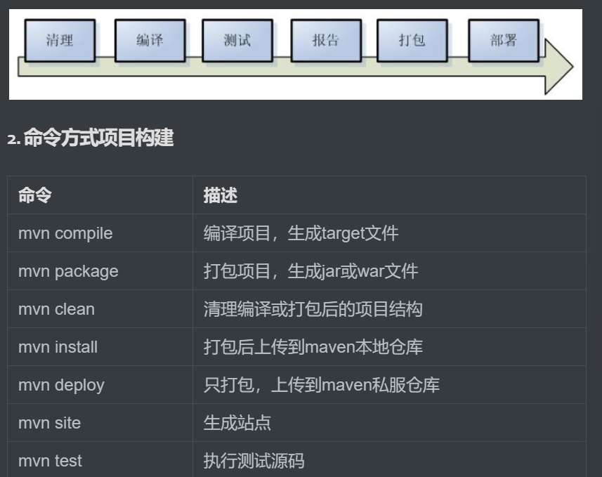
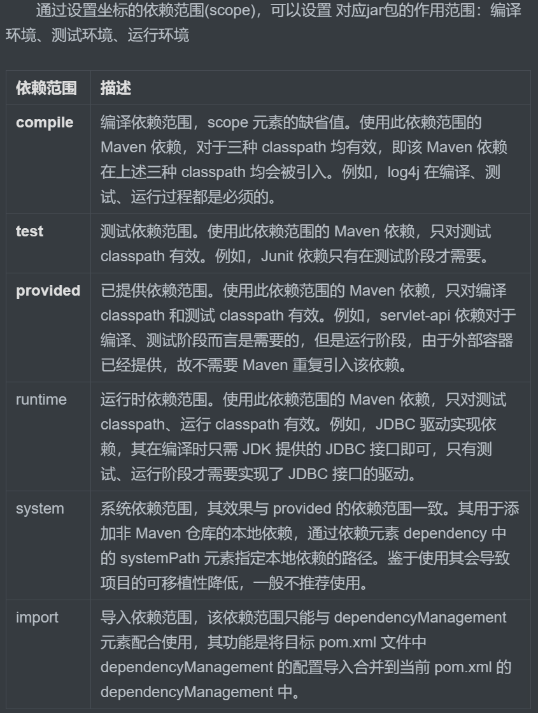

 Maven 高效包管理工具，定义不再介绍。

 ##### Maven的安装
 maven是需要配置环境变量的，安装很简单

 ##### Maven的功能配置
 * 配置maven/conf/settings.xml

``` xml
<!-- 本地仓库配置 -->
<localRepository>E:\Mavenrep</localRepository>

<!--在mirrors节点(标签)下添加中央仓库镜像 160行附近-->
<mirror>
    <id>alimaven</id>
    <name>aliyun maven</name>
    <url>http://maven.aliyun.com/nexus/content/groups/public/</url>
    <mirrorOf>central</mirrorOf>
</mirror>

<!--在profiles节点(标签)下添加jdk编译版本 268行附近-->
<profile>
    <id>jdk-17</id>
    <activation>
      <activeByDefault>true</activeByDefault>
      <jdk>17</jdk>
    </activation>
    <properties>
      <maven.compiler.source>17</maven.compiler.source>
      <maven.compiler.target>17</maven.compiler.target>
      <maven.compiler.compilerVersion>17</maven.compiler.compilerVersion>
    </properties>
</profile>
 ```

>还要配置IDEA中的Maven

### Maven start
##### GAVP
* GroupId
>最多四级，正例：com.taobao.tddl 或 com.alibaba.sourcing.multilang
* ArtifactID
>产品线名-模块名。语义不重复不遗漏，先到仓库中心去查证一下。
正例：tc-client / uic-api / tair-tool / bookstore
* Version
> 主版本号  次版本号  修订号
* Packaging
>指示将项目打包为什么类型的文件，idea根据packaging值，识别maven项目类型！
jar war(web工程) pom(不会打包，用来做继承的父工程) 

##### 构建Maven java web工程
1. 创建maven工程
2. 修改pom.xml
> <packaging>war</packaging>
3. 设置web资源路径和web.xml路径

* JBLJavaToWeb快速创建工程
``` bash
|-- pom.xml                               # Maven 项目管理文件 
|-- src
    |-- main                              # 项目主要代码
    |   |-- java                          # Java 源代码目录
    |   |   `-- com/example/myapp         # 开发者代码主目录
    |   |       |-- controller            # 存放 Controller 层代码的目录
    |   |       |-- service               # 存放 Service 层代码的目录
    |   |       |-- dao                   # 存放 DAO 层代码的目录
    |   |       `-- model                 # 存放数据模型的目录
    |   |-- resources                     # 资源目录，存放配置文件、静态资源等
    |   |   |-- log4j.properties          # 日志配置文件
    |   |   |-- spring-mybatis.xml        # Spring Mybatis 配置文件
    |   |   `-- static                    # 存放静态资源的目录
    |   |       |-- css                   # 存放 CSS 文件的目录
    |   |       |-- js                    # 存放 JavaScript 文件的目录
    |   |       `-- images                # 存放图片资源的目录
    |   `-- webapp                        # 存放 WEB 相关配置和资源
    |       |-- WEB-INF                   # 存放 WEB 应用配置文件
    |       |   |-- web.xml               # Web 应用的部署描述文件
    |       |   `-- classes               # 存放编译后的 class 文件
    |       `-- index.html                # Web 应用入口页面
    `-- test                              # 项目测试代码
        |-- java                          # 单元测试目录
        `-- resources                     # 测试资源目录
```
##### 使用Tomcat启动
so easy
### Maven工程构建
##### Maven 工作流
* 清理 mvn clean
* 编译 mvn compile
* 测试 mvn test
* 报告
* 打包 mvn package 
* 部署

``` bash
mvn clean 
mvn clean package
mvn test
# 如果使用 mvn package
# we all konw that Maven will 执行 从compile-->package
# 而不仅仅是mvn package
```
##### clean生命周期
``` bash
pre-clean
clean 
post-clean

```
##### default生命周期
``` bash
validate
initialize
generate-sources
process-sources
generate-resources
process-resources
compile
process-classes
generate-test-sources
process-test-sources
generate-test-resources
process-test-resources
test-compile
test
prepare-package
package
pre-integration-test
integration-test
post-integration-test
verify
install
deploy
```
##### site生命周期
``` bash
per-site
site
post-site
site-deploy
```
### Maven的依赖管理
我们通过定义 POM 文件，Maven 能够自动解析项目的依赖关系，并通过 Maven **仓库自动**下载和管理依赖，从而避免了手动下载和管理依赖的繁琐工作和可能引发的版本冲突问题

``` xml
<!-- 模型版本 -->
<modelVersion>4.0.0</modelVersion>
<!-- 公司或者组织的唯一标志，并且配置时生成的路径也是由此生成， 如com.companyname.project-group，maven会将该项目打成的jar包放本地路径：/com/companyname/project-group -->
<groupId>com.companyname.project-group</groupId>
<!-- 项目的唯一ID，一个groupId下面可能多个项目，就是靠artifactId来区分的 -->
<artifactId>project</artifactId>
<!-- 版本号 -->
<version>1.0.0</version>

<!--打包方式
    默认：jar
    jar指的是普通的java项目打包方式！ 项目打成jar包！
    war指的是web项目打包方式！项目打成war包！
    pom不会讲项目打包！这个项目作为父工程，被其他工程聚合或者继承！后面会讲解两个概念
-->
<packaging>jar/pom/war</packaging>
```

##### 引入依赖
``` xml
<dependencies>
    <!-- 引入具体的依赖包 -->
    <dependency>
        <groupId>log4j</groupId>
        <artifactId>log4j</artifactId>
        <version>1.2.17</version>
        <!-- 依赖范围 -->
        <scope>runtime</scope>
    </dependency>

</dependencies>
```
``` xml
<!--声明版本-->
<properties>
  <!--命名随便,内部制定版本号即可！-->
  <junit.version>4.12</junit.version>
  <!-- 也可以通过 maven规定的固定的key，配置maven的参数！如下配置编码格式！-->
  <project.build.sourceEncoding>UTF-8</project.build.sourceEncoding>
  <project.reporting.outputEncoding>UTF-8</project.reporting.outputEncoding>
</properties>

<dependencies>
  <dependency>
    <groupId>junit</groupId>
    <artifactId>junit</artifactId>
    <!--引用properties声明版本 -->
    <version>${junit.version}</version>
  </dependency>
</dependencies>
```
