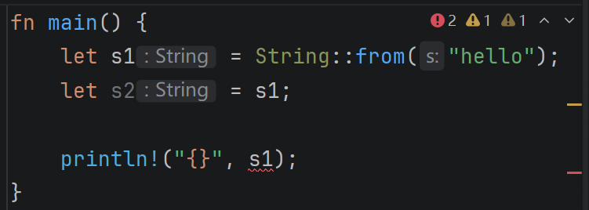
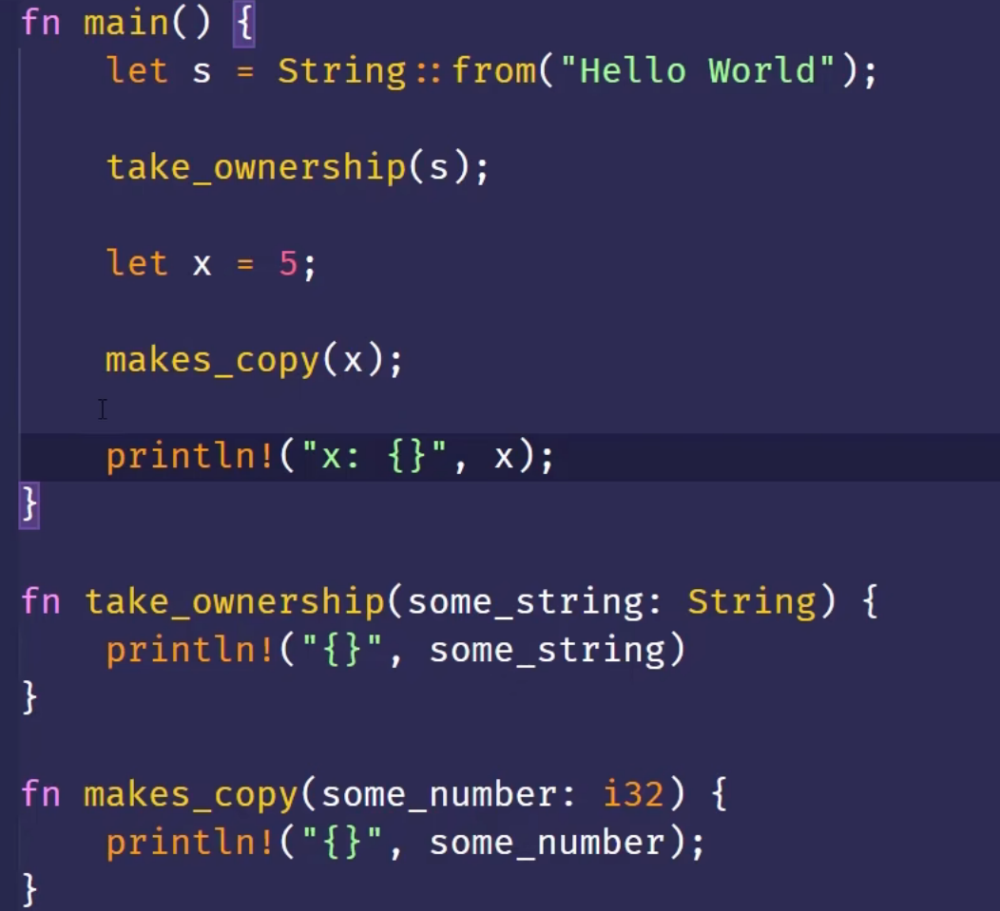
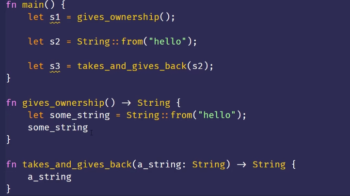
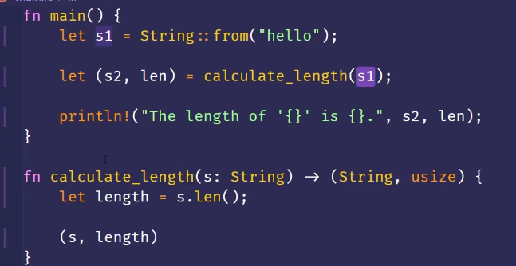
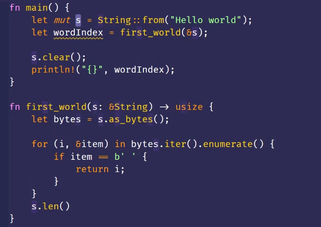

## Rust, 启动!!!

##### rust用户和案例
* 操作系统

##### Rust的优点
* 性能 
* 安全
* 并发
* 只有一个缺点：难学

### Hello Rust
Rust是编译型语言
#### rustc 编译
* exe
* .pdb
* 注意，rust一个缩进不是tab，是4个空格
#### cargo
* 使用cargo新建一个项目 

> cargo new hello_cargo

* `Cargo.toml`是配置文件
    * TOML(Tom's Obvious,Minimal Language)
    * [package] 配置包
    * [dependencies] 配置依赖
    * 在rust中代码的包 叫做crate (货箱)
* `cargo build`
* `cargo run`
* `cargo check`
* `cargo build -release` 编译时会进行优化，让代码运行更快
#### cargo版本管理
* cargo的toml文件用来管理依赖的版本
* 我们如果直接改变toml文件下的依赖的版本
    * 实际的依赖不会变
    * 依赖的版本被锁在了.lock文件下，而且优先级高于.toml
    * 如果确定要更改版本，需要执行`cargo update`
#### 第一个cargo程序
* cargo 默认导入`prelude`

### Rust基本教程
#### 变量与可变性
* `let`声明变量
* 默认下 `变量` 是 `不可变的`
* 在变量前面加上`mut`，变量就是可变的了
#### 常量
* 不可以使用`mut`
* 使用`const`关键字
* 必须标注类型
* 函数名要全大写
* 只能绑定到常量表达式
#### Shadowing
* 可以使用相同变量名来声明新的变量
* `mut`可变但类型不可变
* shadowing主要解决的就是类型转换问题，我们不需要去思考如何命名 

> let in = "   ";
let in = in.len();

``` rust
fn main() {
    let x = 5;
    let y = -5;

    let y1 = &y;

    let x = x + 1; //原本的x会被立即drop
    let y = y -1 ; //原本的y还有人引用，不会被立即drop

    println!("The value of x is: {}", x);  //6
    println!("The value of y is: {}", y);  //-6
    println!("The value of y1 is: {}", y1);  //-5

    {
        let x = x * 2;
        let y = y * 2;
        println!("The value of x is: {}", x);  //12
        println!("The value of y is: {}", y);  //-12
    }

    println!("The value of x is: {}", x);  //6
    println!("The value of y is: {}", y);  //-6
    println!("The value of y1 is: {}", y1);  //-5

}
```

#### 数据类型-标量
##### Integer

| Length 长度 | Signed 有符号 | Unsigned 无符号 |
| --------- | ---------- | ------------ |
| 8-bit     | i8         | u8           |
| 16-bit    | i16        | u16          |
| 32-bit    | i32        | u32          |
| 64-bit    | i64        | u64          |
| 128-bit   | i128       | u128         |
| arch      | isize      | usize        |

##### Number Literals

| Number literals 数字字面值 | 示例            |
| --------------------- | ------------- |
| Decimal 十进制           | `98_222`      |
| Hex 十六进制              | `0xff`        |
| Octal 八进制             | `0o77`        |
| Binary 二进制            | `0b1111_0000` |
| Byte (u8 only) 字节     | `b'A'`        |

* 十进制数可以使用`_`来分隔开，方便view

##### Floating Point
* f32 : 4字节
* f64 : 默认，8字节
* 都有符号

##### Boolean
* 使用bool表示
##### Character
* 4字节
* 表示一个Unicode标量
#### 复杂量
##### Tuple 元组
* 固定长度
* 含有不同类型数据
* 可用自动拆箱
##### Array 数组
* 固定长度
* 相同数据类型
#### 函数和流程控制
由于这些属于编程通用，便不再过多阐述

``` rust
fn main() {
    let y ={
        let x = 1;
        x + 5
    };
    println!("{}", y);
    let y = another_function(1);
    println!("{}", y);
    
}

fn another_function(x:i32) -> i32 {
   x + 5
}
```
大多数语言同时存在while和for，有的语言认为while和for完全重合，便舍去了一个，但是rust却新增了一个loop
* loop
* while
* for

`签名`
rust中有这个语法用来给循环命名，依次来阐述到底如何跳出多重循环

### 所有权
#### 数据存储
* stack
    * 必须拥有已知的大小
* heap
    * 访问较慢
#### 所有权
* 每个值都有一个变量，这个变量是值的所有者
* 每个值同时只能有一个所有者
* 所有者超出作用域scope，将被删除
    * 相对于其他语言
        * 要么是GC
        * 要么是手动释放，有double free的风险

#### 变量与数据交互
* 移动：这是一种新的机制，不是深拷贝，也不是浅拷贝



* 克隆；针对堆上的数据
* 复制：针对栈上的数据
    * Copy trait可以用于实现stack上的类型
        * 几乎所有基本数据
        * 放在堆上的数据一定是
    * 类型实现类Copy trait 旧变量在赋值后仍然可以使用
    * Copy trait 不能 在有 Drop trait时使用

#### 所有权与函数
* 把值传递给函数和把值赋给变量是相同的



* 返回值与作用域



* 所有权的手动借用



#### 引用和借用
* 引用: 引用某些值但不获得所有权
    * 引用时没有"所有权"的指针
    * 引用的作用域
    * 悬空引用：rust编译器保证了不会出现悬垂引用


* 把引用作为参数值就叫做借用

#### 可变引用
* 在特定作用域内，对某一块数据，只能由一个可变引用，这么做是为了防止数据竞争
* 数据竞争(编译时报错)
    * 多指针访问同一个数据
    * 至少有一个指针在写
    * 没有数据同步机制
* 不可以同时有可变引用和不可变引用
#### 切片
下面这个函数拿到`worldIndex`之后，一旦s被清理了，`worldIndex`就失去了意义，所以rust提供了切片

Rust和很多函数不同，`rust左闭右开`

* `let s2 = &s1[..];`
* 所以必须发生在有效的UTF-字符边界
* 对多字节的字符串切片，会报错
* 字符串字面值是切片 
* 定义函数时，可以使用字符串切片`&str`，这样既可以传入字符串切片，也可以传入一个字符串的切片


* 其他类型的切片  
    * 其实就是存储了起始位置和长度