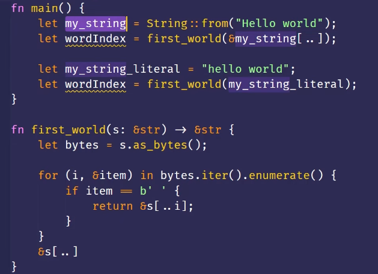
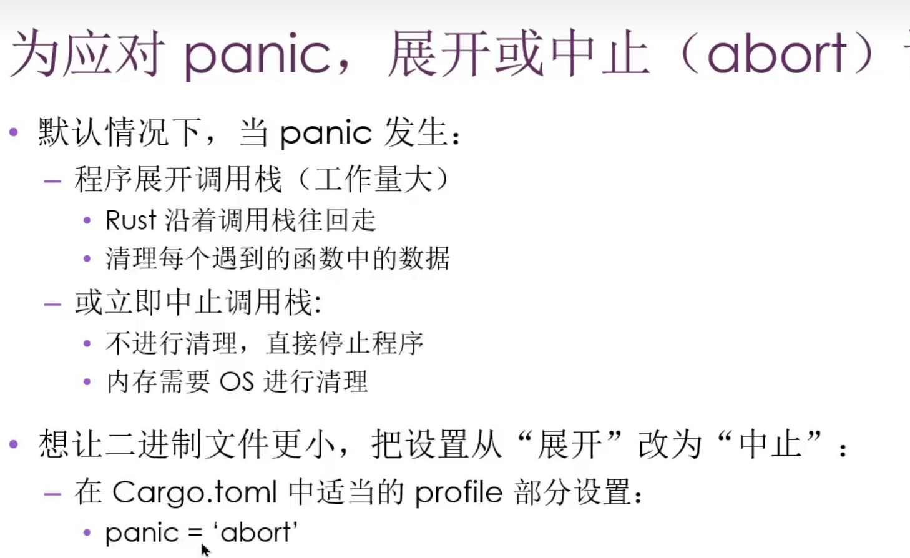
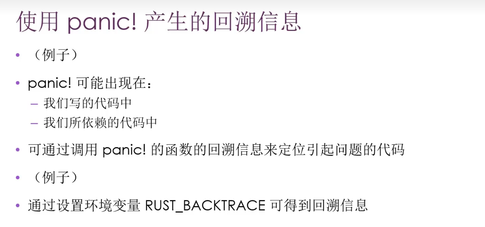

## Rust, 启动!!!

##### rust用户和案例
* 操作系统

##### Rust的优点
* 性能 
* 安全
* 并发
* 只有一个缺点：难学

### Hello Rust
Rust是编译型语言
#### rustc 编译
* exe
* .pdb
* 注意，rust一个缩进不是tab，是4个空格
#### cargo
* 使用cargo新建一个项目 

> cargo new hello_cargo

* `Cargo.toml`是配置文件
    * TOML(Tom's Obvious,Minimal Language)
    * [package] 配置包
    * [dependencies] 配置依赖
    * 在rust中代码的包 叫做crate (货箱)
* `cargo build`
* `cargo run`
* `cargo check`
* `cargo build -release` 编译时会进行优化，让代码运行更快
#### cargo版本管理
* cargo的toml文件用来管理依赖的版本
* 我们如果直接改变toml文件下的依赖的版本
    * 实际的依赖不会变
    * 依赖的版本被锁在了.lock文件下，而且优先级高于.toml
    * 如果确定要更改版本，需要执行`cargo update`
#### 第一个cargo程序
* cargo 默认导入`prelude`

### Rust基本教程
#### 变量与可变性
* `let`声明变量
* 默认下 `变量` 是 `不可变的`
* 在变量前面加上`mut`，变量就是可变的了
#### 常量
* 不可以使用`mut`
* 使用`const`关键字
* 必须标注类型
* 函数名要全大写
* 只能绑定到常量表达式
#### Shadowing
* 可以使用相同变量名来声明新的变量
* `mut`可变但类型不可变
* shadowing主要解决的就是类型转换问题，我们不需要去思考如何命名 

> let in = "   ";
let in = in.len();

``` rust
fn main() {
    let x = 5;
    let y = -5;

    let y1 = &y;

    let x = x + 1; //原本的x会被立即drop
    let y = y -1 ; //原本的y还有人引用，不会被立即drop

    println!("The value of x is: {}", x);  //6
    println!("The value of y is: {}", y);  //-6
    println!("The value of y1 is: {}", y1);  //-5

    {
        let x = x * 2;
        let y = y * 2;
        println!("The value of x is: {}", x);  //12
        println!("The value of y is: {}", y);  //-12
    }

    println!("The value of x is: {}", x);  //6
    println!("The value of y is: {}", y);  //-6
    println!("The value of y1 is: {}", y1);  //-5

}
```

#### 数据类型-标量
##### Integer

| Length 长度 | Signed 有符号 | Unsigned 无符号 |
| --------- | ---------- | ------------ |
| 8-bit     | i8         | u8           |
| 16-bit    | i16        | u16          |
| 32-bit    | i32        | u32          |
| 64-bit    | i64        | u64          |
| 128-bit   | i128       | u128         |
| arch      | isize      | usize        |

##### Number Literals

| Number literals 数字字面值 | 示例            |
| --------------------- | ------------- |
| Decimal 十进制           | `98_222`      |
| Hex 十六进制              | `0xff`        |
| Octal 八进制             | `0o77`        |
| Binary 二进制            | `0b1111_0000` |
| Byte (u8 only) 字节     | `b'A'`        |

* 十进制数可以使用`_`来分隔开，方便view

##### Floating Point
* f32 : 4字节
* f64 : 默认，8字节
* 都有符号

##### Boolean
* 使用bool表示
##### Character
* 4字节
* 表示一个Unicode标量
#### 复杂量
##### Tuple 元组
* 固定长度
* 含有不同类型数据
* 可用自动拆箱
##### Array 数组
* 固定长度
* 相同数据类型
#### 函数和流程控制
由于这些属于编程通用，便不再过多阐述

``` rust
fn main() {
    let y ={
        let x = 1;
        x + 5
    };
    println!("{}", y);
    let y = another_function(1);
    println!("{}", y);
    
}

fn another_function(x:i32) -> i32 {
   x + 5
}
```
大多数语言同时存在while和for，有的语言认为while和for完全重合，便舍去了一个，但是rust却新增了一个loop
* loop
* while
* for

`签名`
rust中有这个语法用来给循环命名，依次来阐述到底如何跳出多重循环

### 所有权
#### 数据存储
* stack
    * 必须拥有已知的大小
* heap
    * 访问较慢
    
#### 所有权
* 每个值都有一个变量，这个变量是值的所有者
* 每个值同时只能有一个所有者
* 所有者超出作用域scope，将被删除
    * 相对于其他语言
        * 要么是GC
        * 要么是手动释放，有double free的风险

#### 变量与数据交互
* 移动：这是一种新的机制，不是深拷贝，也不是浅拷贝


* 克隆；针对堆上的数据
* 复制：针对栈上的数据
    * Copy trait可以用于实现stack上的类型
        * 几乎所有基本数据
        * 放在堆上的数据一定是
    * 类型实现类Copy trait 旧变量在赋值后仍然可以使用
    * Copy trait 不能 在有 Drop trait时使用

#### 所有权与函数
* 把值传递给函数和把值赋给变量是相同的


* 返回值与作用域


* 所有权的手动借用


#### 引用和借用
* 引用: 引用某些值但不获得所有权
    * 引用时没有"所有权"的指针
    * 引用的作用域
    * 悬空引用：rust编译器保证了不会出现悬垂引用


* 把引用作为参数值就叫做借用

#### 可变引用
* 在特定作用域内，对某一块数据，只能由一个可变引用，这么做是为了防止数据竞争
* 数据竞争(编译时报错)
    * 多指针访问同一个数据
    * 至少有一个指针在写
    * 没有数据同步机制
* 不可以同时有可变引用和不可变引用
#### 切片
下面这个函数拿到`worldIndex`之后，一旦s被清理了，`worldIndex`就失去了意义，所以rust提供了切片

Rust和很多函数不同，`rust左闭右开`

* `let s2 = &s1[..];`
* 所以必须发生在有效的UTF-字符边界
* 对多字节的字符串切片，会报错
* 字符串字面值是切片 
* 定义函数时，可以使用字符串切片`&str`，这样既可以传入字符串切片，也可以传入一个字符串的切片


* 其他类型的切片  
    * 其实就是存储了起始位置和长度


### Struct

#### struct 基础
* 必须全部赋值
* 点标记法取属性
* 一旦实例是`mut`，所有属性都是mut
* 手搓构造方法省略字段名

```  rust
struct User{
    username: String,
    email: String,
}

fn build_user(email:String,username:String) -> User {
    User {
        username,
        email,
    }
}
```

#### struct more
* struct更新语法(可以创建一个基于已有数据的数据)

``` rust   
 let user2 = User {
        username:String::from("a"),
        ..usr1
    };
```   

* Tuple struct 
    * 更像是一个tuple 
    * 方便我们进行给tuple分类，不同的tuple struct实际上是不同struct,感觉这里更偏向类一点
``` rust
fn main() {
    struct Color(i32, i32, i32);
    struct Point(i32, i32, i32);

    let black = Color(0, 0, 0);
    let origin = Point(0, 0, 0);
    
    fn cal_Point(p1: Point,p2: Point) -> Point{
         Point(p1.0+p2.0, p1.1+p2.1, p1.2+p2.2)
    }
    
    //let point = cal_Point(black,origin);   报错
    //let point = cal_Point(origin,origin);   报错，所有权在第一个origin的时候就没了
    let p1 = Point(0, -1, 0);
    let p2 = Point(1, 0, 2);
    
    let p3 = cal_Point(p1,p2);
    println!("{}", p3.2);
    let black_red:i32 = black.0;
}
```

* Unit-Like struct 
    * 需要在某个类型上实现某个trait，但又不想存储数据

``` rust
struct GaussianPlume;  // 高斯羽流模式
struct Lagrangian;     // 拉格朗日模式

// 这种方式可以在编译时确保你使用了正确的物理模型，而不需要在运行时通过 if/else 判断字符串。
trait Formalizer {
    fn convert(&self, input: &str) -> String;
}

struct LatexFormatter; // 仅作为逻辑载体

impl Formalizer for LatexFormatter {
    fn convert(&self, input: &str) -> String {
        format!("\\begin{{equation}}{}\\end{{equation}}", input)
    }
}

```

* struct 的所有权
    * 生命周期保证了只要struct是有效的，里面的引用也是有效的
    * TODO这里比较重要

#### A demo

``` rust
#[derive(Debug)]
struct Rectangle{
    width: u32,
    height: u32,
}
fn main() {
    let rect = Rectangle{width: 30, height: 50};

    println!("are: {}" ,area(&rect));
    println!("rect: {:?}", rect);
    println!("rect: {:#?}", rect);
}

fn area(rec: &Rectangle) -> u32 {
    rec.width * rec.height
}
```

* Struct 就像是一个“容器标签”：
    * 普通 Struct：带名字的文件夹（知道里面每个文件叫什么）。
    * Tuple Struct：不带名字但有固定顺序的文件夹（知道第一个、第二个文件是什么）。
    * Unit Struct：一个空的、仅用于占位的标签（只告诉编译器“我在这里”）。

#### struct 的方法
* 方法与函数
    * 类似：fn, param, return,name
    * 不同:
        * 方法是在struct的上下文定义的
        * 方法的第一个参数是self，表示方法调用的struct实例

* 用法
    * 在impl中实现
    * 方法的第一个参数是self，可以获得所有权或者可变借用
``` rust
struct Rectangle{
    width: u32,
    height: u32,
}
impl Rectangle {
    fn area(&self) -> u32 {
        self.width * self.height
    }
    fn can_hold(&self, other: &Rectangle) -> bool {
    self.width > other.width && self.height > other.height
    }
}
struct Point(u32, u32);
fn main() {
    let point1 = Point(5, 5);

    let rect = Rectangle{width: 30, height: 50};
    println!("The area of the rectangle is {}", rect.area());
}
```

* 方法调用的运算符
    * rust没有`->`符号
    * rust有自动解引用
    

* 关联函数
    *  在impl中可以声明的函数 
    * 通常用来做实例化函数
    * 第一个参数不需要是`&self`
    * 相当于是静态方法，实例不能调用

``` rust
impl Rectangle {
    fn square(size: u32) -> Rectangle {
        Rectangle{
            width:size,
            height:size
        }
    }
}
fn main() {
   let a = Rectangle::square(3);
}
```

* struct 允许有多个`impl`块

### 枚举与模式匹配(Rust中强悍的数据类型)
#### 枚举
* 枚举允许我们列举所有可能的值来定义一个类型
    * 记住这一点十分强大

    >我这样来简单说一下，比如你要给一个类定义一个ip的标签，
    在java中，我想大多数人都选择使用给一个IpAddr{ipflag: ipString}我们用一个标记属性，用枚举类来区分IpAddr是哪个
    但是在rust中，我们甚至可以直接给枚举定义不同的类型,而不需要flag标记
* 存在于命名空间中
* 数据可以附加在枚举的变体中
* 甚至可以有`impl`方法

``` rust
enum IpAddrKind{
    V4(u8, u8, u8, u8),
    V6(String)
}
enum Message{
    Quit,
    Move{x: i32, y: i32},
    Write(String),
    ChangeColor(i32, i32, i32)
}

impl Message{
    fn call(&self){
        
    }
}

fn main() {
    let four = IpAddrKind::V4;
    let six = IpAddrKind::V6;

    route(IpAddrKind::V4(127, 0, 0, 1));

}

fn route(ip: IpAddrKind){

}
```

#### Option
* 存在标准库中
    * 包含在预导入模块
* Rust没有Null，但有Null概念
* Option<T>类似null的概念
* 包括
    * Option<T>
    * Some(T)
    * None: 必须显示声明，编译器无法推断

``` rust
fn main() {
    let some_number = Some(5);
    let some_string = Some("a string");
    let absent_number: Option<i32> = None;
}
```

>这种语言设计的好处就是，对于一个T类型，我搞了一个Option<T>，你如果想用，你就自己把Option<T>转为T，这样就很好的保证了，我如果直接处理两个T，就一定不会有其他不同的错误，但是对于其他语言都需要考虑空指针的情况。
说到这里就不得不吐槽了，我明明前一个逻辑保证了我传入的值不为空，但是你看到我这里的代码总是想让我加一个非空判断，我都说了这里不用加，写注释你又看不到，非得我加个断言你才信

#### match
* 允许一个值与一系列模式进行匹配，并执行匹配的模式对应的代码
* 模式可以是字面值，变量名，通配符
* (我觉得现代语言不该有switch这种东西)
    * 但是java里面有switch赋值表达式，emm也算是升级switch了吧，java的switch和match有点接近了
* 控制流运算符，我们要用match取代switch

``` rust
fn main() {
    let b = 4;
    let a = match b {
        1 => {
            println!("Hello, world!");
            1
        }
        o => 2  //我们甚至能把这个值拿到
        
    };
}
```

* 绑定值


* 匹配Option<T>

``` rust
fn main() {
    let five = Some(5);
    let six = plus_one(five);
    let none = plus_one(None);
}

fn plus_one(x: Option<i32>) -> Option<i32> {
    match x {
        Some(i) => Some(i + 1),
        None => None
    }
}
```

* 用match必须处理所有情况，如果你觉得没必要处理，就用`_`显式标明出来

``` rust
fn main() {
    let v = 0u8;  //rust的后缀定义类型写法
    match v{
        1 => println!("one"),
        _ => println!("other"),
    }
}
```
#### if let 简单控制流
* 只关注一种匹配:优化上面的那块代码
* 这样和直接使用`if` 其实差距很大
    * 分工不同，if就负责判断bool，if let是模式匹配，这意味着你可以通过值绑定，直接拿到值，而不是手动解构，而且手动解构在一些情况下还是禁止的
``` rust
if let 1 = v {
    println!("one");
}
```

### Package,Crate,Module
* Package: 
* Crate:
* Module:use 
* Path:


#### Package Crate
* Crate
    * binary
    * library
* Crate Root
    * 是源代码文件
    * Rust编译器从这里开始，组成你都Crate的根Moudle
* 一个Package
    * 一个Cargo.toml
    * 0-1个lib crate
    * 任意个bin crate
    * 至少一个crate

* src/main.rs
    * binary crate 的 crate root
    * crate 与 package相同名字
* src/lib.rs
    * package包含一个lib crate
    * lib crate 的 crate root
    * crate 与 package相同名字
* 上面的俩文件会交给rustc

#### module
* 在crate中进行分组
* 可控制私有性
* mod关键字
* 可嵌套
* 可包含其它项的定义


#### Path
* 绝对路径: 从crate root 开始，使用crate名或 字面值
* 相对路径: 从当前模块开始,使用self super

* privacy boundary： rust默认私有
* 父无法使用子私有
* 子可使用父所有
* 兄弟可调用

* super 表示上一级:在相对路径中适用

* 就算你给struct 设置pub，struct的属性还是默认私有，也要pub
* pub menu

#### use 
* 像是using namespace
* 对于函数推荐引用到上一级:将函数的父级模块引入到作用域
* 对于struct的话，推荐引用到本身
* 对于同名条目，就需要引用到父级了
* 还有`as`关键字，

``` rust
mod front_of_house{
    pub mod hosting{
        pub fn eat_at_restaurant(){}
    }
}

use front_of_house::hosting; //你要是直接引用到函数，
//你就和那种c++纯小子一模一样了

pub fn eat_at_restaurant(){
    hosting::eat_at_restaurant();
    hosting::eat_at_restaurant();
    hosting::eat_at_restaurant();
}
```
* 上面代码中，尽管我们使用use，但是对于外部文件(use了本文件)的文件来说,use引入进来默认为私有，是看不到内部的
* 我们需要`pub use`
* 这个就很爽了，你想用我的包，我的包引用的包你全都默认看不见，这是好事啊，因为你本来就不关注我想不想用这些

#### 使用package
* Cargo.toml
* use到作用域
* std甚至也是外部包，不过被内置在toml里面了

``` rust
use std::io::{self,Write};
use std::collections::* ; //谨慎使用
```
#### 模块化
* 太人性了，强制你把模块放到`模块路径名文件夹/文件名`

### 常用集合
* 放在heap上
* 与array tuple不同

#### Vector<T>
* 标准库提供
* 存储多个值
* 同类型
* 在内存中连续存放
* 离开作用域之后就没了
* 什么时候用索引，什么时候用.get()
* 遍历用 for

``` rust
//Vector learn

pub fn run() {
    println!("Hello, try01!");
    let v1:Vec<i32> = Vec::new();
    println!("{:?}", v1);
    let v2 = vec![1, 2, 3];
    println!("{:?}", v2);

    let mut v = vec![1, 2, 3];
    v.push(5);  //无敌的上下文类型推断
    //这编译器无敌了
    let third: &i32 = &v[2];
    println!("The third element is {}", third);

    let third: Option<&i32> = v.get(2);
    let third = match v.get(2){
        Some(third) => third,
        None => &5
    };
    //上面的match可用下面的方法回调替代
    let third = v.get(2).unwrap_or_else(|| &5);

    //注意，下面一个错误的示例：引用交叉
    let first = &v[0];
    v.push(6);
    println!("The first element is {}", first);

    for i in &v {
        println!("{}", i);
    }
    for i in &mut v {
        *i += 50;
    }
    for i in  v {
        i + 50;
    }

    //后续没有v的使用权了

}
```

#### Vector enum
众所周知，Vector存储同一种类型的数据类型，而enum可以有不同类型的附加数据，所以这俩就擦出来了神奇的火花
``` rust
enum SpreadsheetCell {
    Int(i32),
    Float(f64),
    Text(String),
}

pub fn run(){
    let row = vec![
        SpreadsheetCell::Int(3),
        SpreadsheetCell::Text(String::from("blue")),
        SpreadsheetCell::Float(10.12),
    ];
}
```
#### String
* rust用utf-8，这带来了很多困扰
* String  和  &str

``` rust

pub fn run(){
    let mut s = String::new();
    let s = "hello world".to_string();
    let s2 = "hello world";
    //from 函数
    let mut s = String::from("hello world");
    //push添加
    s.push_str(", world");
    s.push('!');
    //+ 连接
    let s1  = String::from("hello");
    let s2 = String::from("world");
    let s3 = s1 + &s2;

    println!("{}", s3);
    println!("{}", s1);  //报错
    println!("{}", s2);
    //这里可以这样解释，对于"+"
    //相当于执行了 s1.add(self, &str)的方法
    //自己的所有权转移了，到了更小的生命周期
    //所以访问不到了
    //而s2的所有权可以保留

    //format! 添加
    let s = format!("{}-{}-{}", s1, s2, s3);

}
```

#### String 是 utf-8
* 不能按照索引访问
* Stirng 是对`Vec<u8>`的包装
* 字符串看待方式
    * 字节
    * 标量值
    * 字形簇

``` rust
pub fn run(){
    let len = String::from("我是人").len();
    println!("{}", len);  //len = 9

    let w = String::from("神说要有光，然后有了rust");
    for b in w.bytes() {
        println!("{}", b);
    }
    for b in w.chars() {
        println!("{}", b);
    }

    //获取字形簇：没有这个方法
}
```
#### HashMap<K,V>
* 不在Prelude中，需要自己导入
* 没有内置的宏(也就是`!`)
* heap上存数据
* 是同构的
* collect构建HashMap
* HashMap的所有权
    * 对于实现了Copy trait 的类型，值会复制到HashMap
    * 对于拥有所有权的，所有权会移动

#### 更新HashMap
* key存在
    * 覆盖
    * 丢弃
    * 合并
* key不存在
    * 新建

* `entry`方法返回一个Entru枚举

### Rust错误处理
* 可恢复错误
    * Result<T,E>
* 不可恢复错误
    * `panic!` 宏
    * 打印错误信息
    * 展开或终止调用栈
    



#### Result枚举
* enum Result<T,E>{
    Ok(T),
    Err(E),
}

``` rust
use std::fs::File;

pub fn run(){
    let f = File::open("Cargo.toml") ;
    let f = match  f {
        Ok(f) => f,
        Err(e) => {
            panic!("{}", e);
        }
    };
}
```

* unwarp()操作
    * 如果Result结果是Ok,返回其中的值
    * 如果结果是Err,调用panic!
* expect
    * 自定义panic打印信息

``` rust
use std::fs::File;
pub fn run(){
    let f = File::open("argo.toml").unwrap();
    let f = File::open("Cargo.toml").expect("Cargo.toml");
}
```

* 传播错误

``` rust
fn read_username_from_file2() -> Result<String,io::Error>{
    let mut f = File::open("hello.txt")?;
    let mut s = String::new();
   f.read_to_string(&mut s) ?;
    Ok(s)
}

fn read_username_from_file() -> Result<String,io::Error>{
    let f = File::open("hello.txt");
    let mut f = match f {
        Ok(file) => file,
        Err(error) => return Err(error),
    };
    let mut s = String::new();
    match f.read_to_string(&mut s) {
        Ok(_) => Ok(s),
        Err(error) => return Err(error),
    }
}
```

这个用`?`的简写，实质上就是自动match了,要么`Ok`，把值拿到，要么直接`return Err(e)`。还有一点，就是最后一行的`Ok(s)`一定要加

#### form 与 ?
* Trait std::convert::From 上的from函数：用于错误之间的转换
* ?接受的错误，会被from隐式处理
* ?只用于返回值是Result的函数
* ? 与 main函数 , main函数返回值竟然可能是Result<T,E>

``` rust
use std::fs::File;
use std::error::Error;
fn main() -> Result<(), Box<dyn Error>> {
    let file = File::open("./test.txt")?;
    Ok(())
}
```
#### 什么时候panic
* 没有恢复的可能！！！
* some examples
    * 代码最终可能处于损坏状态
    * 损坏状态(Bad State):某些假设，保证，约定或者不可变性被打破
    ``` rust
        
    ```


### 泛型，Trait，生命周期

#### 泛型的使用
* 泛型基本用法
* rust允许方法中出现`impl`没有声明的泛型
* rust泛型在编译的时候进行`单态化`
    * 也就是你有多少种泛型，我就在编译期间进行多少种代码复制
    * 运行时速度不受影响，编译时间更长

#### Trait 
* 抽象的定义共享行为
* 其实就像是接口，但有很多不同
* 把方法签名放在一起，来定义实现某种目的 所必需的一组行为


##### Trait的约束
* 这个类型或者这个trait是在本地crate定义的
    * 禁止你把第三方库中的struct拿第三方trait
* 孤儿原则:

* 默认实现
    * 我们可以选择保留，重载，实现trait的方法

``` rust
pub trait Summary {
    fn summarize_authot(&self) -> String;
    fn summarize(&self) -> String{
        format!("(Read more from {} ...)", self.summarize_authot())
    }
}

pub struct NewsArticle {
    pub headline: String,
    pub location: String,
    pub author: String,
    pub content: String,
}

impl Summary for NewsArticle {
    fn summarize_authot(&self) -> String {
        format!("{}, by {} ({})", self.headline, self.author, self.location)
    }
}
pub fn run(){
    let article =  NewsArticle{
        headline: String::from("dfs"),
        content:String::from("dfsa"),
        author:String::from("dfa"),
        location:String::from("dfa"),
    };
    println!("{}", article.summarize());
}
```

##### Trari作为参数
* impl trait语法: 适用于简单情况
* trait bound 语法:可用于复杂情况

``` rust
fn example(item : impl Summary+Display){
    println!("{}", item.summarize());
}
fn example2<T:Summary+Display>(item1 : T, item2 : T){
    println!("{}", item1.summarize());
}
fn example3<T,U>(item1 : T, item2 : U)
where
    T : Summary + Display,
    U : Summary + Display,
{
    println!("{}", item1.summarize());
}
```

* 返回类型实现Trait
* impl trait之后，函数禁止有不同类型的返回值，如果有就报错
    * 有很多不理解，你为什么不支持我返回多种类型
    * 其实，这是rust基于安全性和性能所做的取舍,编译器必须知道你要返回的值的大小,要预留多少栈空间
    * 但是，这种也有相应的解决办法：使用`enum`
    * 一切禁止返回不同类型的都可以使用enum来解决

``` rust
fn example4<T:Summary+Display>(item1 : T, item2 : T)-> impl Summary + Display{
    
}
```

##### trait bound
* 在`impl`块上使用`trait bound`,可以有条件的实现特定类型Trait的实现方法
* 覆盖实现

``` rust
impl<T: Display> Summary for T {
    fn summarize_author(&self) -> String {
        format!(" Hi, {}!", self.to_string())
    }
}
```

#### 生命周期
* 避免悬垂引用
* 借用检查器

``` rust
fn get_str(a:&str, b:&str)-> &str {  //报错expected named lifetime parameter
    a
}

fn get_str<'a>(a:& 'a str, b:& 'a str)-> & 'a str {   
    a  //雷霆语法: 声明周期的标注
}  
```
#### 生命周期的标注
* 生命周期的标注不会改变引用的生命周期的长度
* 当制定了泛型生命周期参数，函数可以接收带有任何生命周期的引用

##### fn生命周期标注
* 生命周期的标注：
* 函数的声明周期标注
``` rust
&i32
& 'a i32
& 'a mut i32
fn get_str<'a>(a:& 'a str, b:& 'a str)-> & 'a str;
```


这个可以清楚的理解报错原因

* 函数返回引用时，返回类型的生命周期参数需要与其中一个参数的生命周期匹配
* 如果不这么做，那么返回的值都是只在函数内部生命周期，出函数就变成了悬垂引用

``` rust
fn example<'a>(a:& 'a str, b:& 'a str)-> & 'a str {
    let result = String::from("hzy");
    result.as_str()  //报错了 
```
##### Struct生命周期标注
* 如果内部有引用，必须添加生命周期标注

``` rust
struct MyStruct<'a> {
    part: & 'a str,
}
```
##### 生命周期的省略
* 某些情况写入了rust编译器
* 三大规则
    * 每个引用类型的参数都有自己的生命周期
    * 如果只有1个输入，那么输入的生命周期会赋给所有的输出生命周期参数
    * 多个输入生命周期参数，其中一个是`&self` 和 `&mut self`，那么`self`的生命周期赋值给输出


``` rust
struct MyStruct<'a> {
    part: & 'a str,
}

impl<'a> MyStruct<'a> {
    fn level(&self) -> i32 {
        3
    }
    fn example(&self,b:& str) -> &str {
        self.part
    }
}
```

##### 静态生命周期

